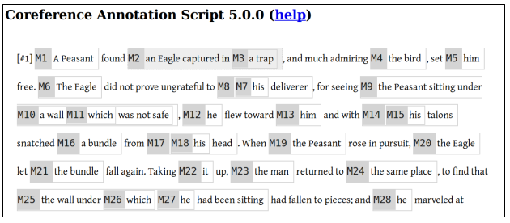
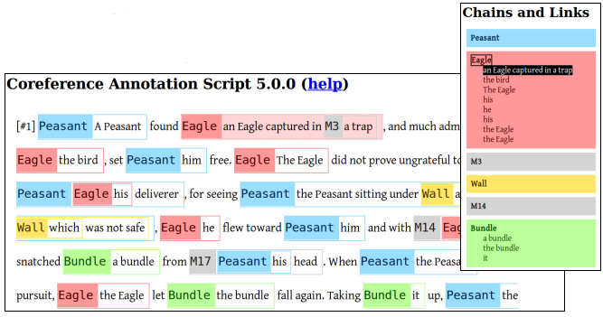
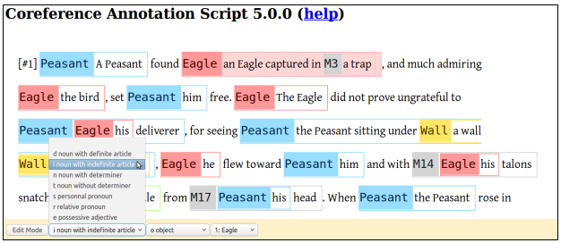
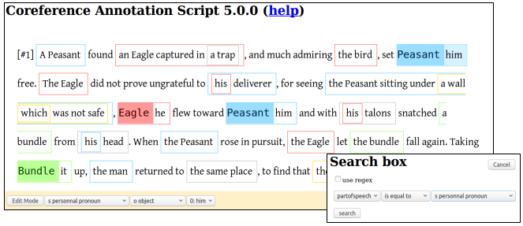

# SACR -- Coreference Chain Annotation Tool

## Introduction

SACR (from the French "Script d'Annotation des Chaînes de Référence") is a tool optimized for coreference chain annotation.  It has been published in the following paper:

[Oberle B. (2018). **SACR: A Drag-and-Drop Based Tool for Coreference Annotation.** _Proceedings of the 11th Edition of the Language Resources and Evaluation Conference (LREC 2018)_. Miyazaki, Japan.](http://www.lrec-conf.org/proceedings/lrec2018/summaries/178.html)

You can download the poster [here](http://boberle.com/publications/res/Oberle-2018_lrec_poster.pdf).

## Usage

SACR is a single webpage.  All operations are done in the browser.  You can download it and open the `index.html` file, or use it online at [boberle.com](http://boberle.com/projects/sacr).

The workflow is as follows:

(1) Mark the referring expressions:

(2) Build the coreference chains:

(3) Add feature annotations:

(4) Play and search:

## Getting help

Documentation can be found in the `user_guide.pdf` file.

Some video tutorials (in French) are available at http://boberle.com/projects/sacr.

## Source code and licence

Source code may be found on [github](https://github.com/boberle/sacr) or [boberle.com](http://boberle.com).

The tool is distributed under the terms of the Mozilla Public License v2.  This program comes with ABSOLUTELY NO WARRANTY, see the LICENSE file for more details.

